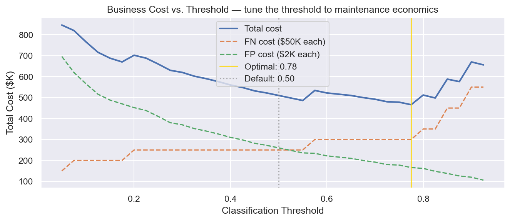
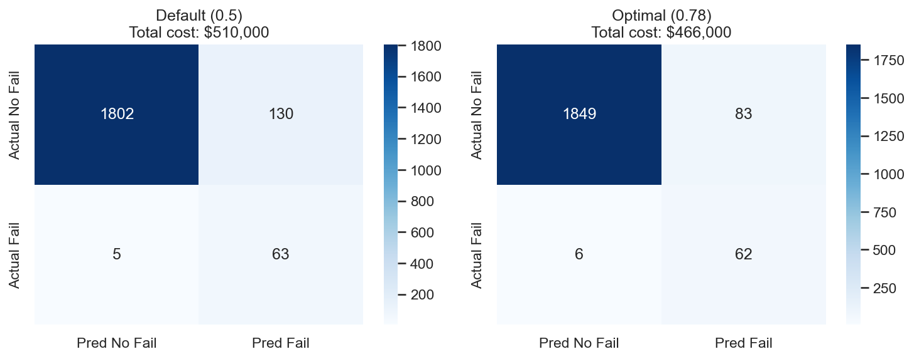
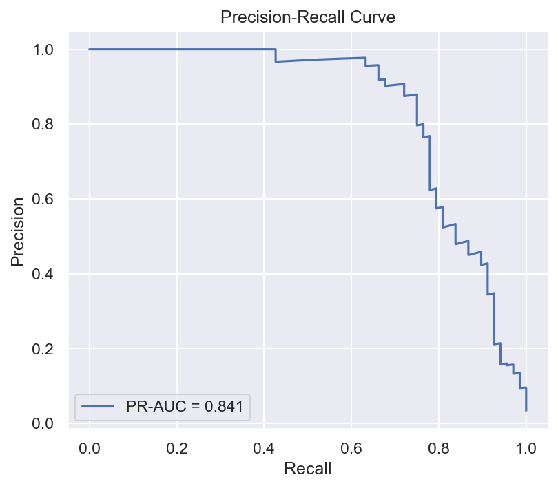

# Industrial Failure Classification

> **Imbalanced-class binary failure prediction tuned for actual maintenance economics: the threshold that minimizes downtime cost is 0.775, not the default 0.5.**

[](https://www.python.org/)
[](https://xgboost.readthedocs.io/)
[](https://scikit-learn.org/)
[](https://fastapi.tiangolo.com/)

In industrial settings, equipment failures are rare (~3% of records) but catastrophic. A model that predicts "no failure" on every input achieves 97% accuracy while being completely useless. This project builds a **business-cost-tuned failure classifier** — selecting the optimal prediction threshold based on real maintenance economics, not statistical defaults.

**Live demo:** [industrial-failure-classification.vercel.app](https://industrial-failure-classification.vercel.app)  
**API docs:** [industrial-failure-classification.onrender.com/docs](https://industrial-failure-classification.onrender.com/docs)

> Note: the API runs on Render's free tier and spins down when idle — the first request may take ~50 seconds while it wakes.

---

## The Key Insight: Threshold Tuning

Standard ML defaults to a 0.5 probability threshold. For failure prediction, that's wrong.

```python
# Business cost analysis for threshold selection
# A missed failure (FN) costs $50,000 in unplanned downtime
# An unnecessary maintenance call (FP) costs $2,000
# Find the threshold that minimizes total operational cost

for threshold in np.arange(0.1, 0.9, 0.05):
    preds = (failure_proba >= threshold).astype(int)
    fn_cost = ((preds == 0) & (y_test == 1)).sum() * 50_000
    fp_cost = ((preds == 1) & (y_test == 0)).sum() * 2_000
    total_cost = fn_cost + fp_cost
```

At the default 0.5 threshold: catches most failures, but creates extra false alarms.  
At the **cost-optimal threshold (0.775 in the current quick-build artifact)**: total estimated cost drops by reducing unnecessary maintenance calls while keeping recall above 91%.

Maintenance managers don't think in F1 scores — they think in downtime costs. This threshold choice translates the model into those terms.

---

## Architecture

```
AI4I 2020 Predictive Maintenance Dataset
(10,000 records · 5 features · 3.4% failure rate)
        ↓
notebooks/01_eda.ipynb         — Class imbalance, feature distributions
notebooks/02_modeling.ipynb    — LR → RF → XGBoost + SMOTE + class weights
notebooks/03_evaluation.ipynb  — Confusion matrix, ROC, PR curve, cost analysis
notebooks/04_shap.ipynb        — Feature importance + individual prediction SHAP
        ↓
scripts/train_model.py         — Repeatable model build for deployment artifacts
        ↓
src/model.py                   — Training, evaluation, threshold selection
src/features.py                — Feature engineering
        ↓
api/main.py (FastAPI → Render)
        ↓
frontend/ (Vanilla JS → Vercel)
  Risk card: 🟢 Low / 🟡 Medium / 🔴 High + probability + top SHAP factors
```

---

## Dataset

**AI4I 2020 Predictive Maintenance** (UCI ML Repository)  
Source: [archive.ics.uci.edu/dataset/601](https://archive.ics.uci.edu/dataset/601/ai4i+2020+predictive+maintenance+dataset)

| Feature | Description | Physical meaning |
|---------|-------------|-----------------|
| Air temperature [K] | Ambient air temp | Operating environment |
| Process temperature [K] | Component temp | Heat buildup = stress |
| Rotational speed [rpm] | Motor speed | Load indicator |
| Torque [Nm] | Shaft torque | Mechanical stress |
| Tool wear [min] | Cumulative wear time | Degradation clock |
| **Machine failure** (target) | Binary 0/1 | ~3.4% failure rate |

Five specific failure modes also labeled: Tool Wear Failure (TWF), Heat Dissipation Failure (HDF), Power Failure (PWF), Overstrain Failure (OSF), Random Failures (RNF).

---

## Model Comparison

Current results from the executed notebooks and `scripts/train_model.py`, using an 80/20 stratified train/test split.

| Model | PR-AUC | F1 | Recall | Precision | Notes |
|-------|--------|-----|--------|-----------|-------|
| Logistic Regression (baseline) | 0.455 | 0.311 | 0.868 | 0.189 | class_weight='balanced' |
| Random Forest | 0.820 | 0.682 | 0.868 | 0.562 | SMOTE |
| **XGBoost** | 0.841 | 0.601 | 0.897 | 0.452 | SMOTE + scale_pos_weight |
| XGBoost @ cost-optimal threshold | 0.841 | 0.582 | 0.912 | 0.428 | threshold=0.775, FN=$50K, FP=$2K |

### Evaluation Figures







---

## Tech Stack

| Layer | Tool |
|-------|------|
| Modeling | XGBoost + scikit-learn RF + Logistic Regression |
| Imbalance handling | SMOTE (imblearn) + class_weight / scale_pos_weight |
| Evaluation | Confusion matrix, PR curve, ROC-AUC, F1 |
| Interpretability | SHAP (notebooks) · XGBoost native `pred_contribs` (API) |
| API | FastAPI on Render |
| Frontend | Vanilla HTML/CSS/JS on Vercel |

---

## Setup

```bash
git clone https://github.com/aalias01/industrial-failure-classification
cd industrial-failure-classification

conda env create -f environment.yml
conda activate industrial-failure
python -m ipykernel install --user --name industrial-failure --display-name "industrial-failure"

# Data downloads automatically in notebook 01 via UCI URL
# Or manually: https://archive.ics.uci.edu/dataset/601/ai4i+2020+predictive+maintenance+dataset

# Quick model build for API artifacts
python scripts/train_model.py

# Run notebooks in order: 01 → 02 → 03 → 04
# Then: uvicorn api.main:app --reload
```

Expected model artifacts after training:

- `models/xgb_classifier.joblib`
- `models/scaler.joblib`
- `models/model_meta.json`
- `figures/model_results.json`

The committed quick-build artifact currently uses a cost-selected threshold of `0.775`.

---

## Design Decisions

1. **Accuracy is misleading here.** Predicting "no failure" always gives 97% accuracy on this dataset. The project optimizes PR-AUC and F1 instead — the metrics that actually matter under class imbalance.

2. **Threshold tuning over defaults.** The default 0.5 threshold was not the economic optimum. A cost model — $50K for a missed failure vs. $2K for unnecessary maintenance — selects the threshold that minimizes total estimated maintenance cost (0.775 in the current artifact).

3. **SMOTE + scale_pos_weight.** SMOTE generates synthetic minority-class samples in feature space, not just duplicates. Combined with XGBoost's `scale_pos_weight`, it gave the best recall without sacrificing too much precision.

4. **Physics-consistent explanations.** Power, rotational speed, tool wear, and torque are the strongest SHAP contributors — consistent with mechanical stress and accumulated wear physics.

5. **Classification, not RUL regression.** CMAPSS-style projects predict *how many cycles remain* (regression); this predicts *will it fail in the next N cycles* (classification). Same domain, different paradigm.

---

*Built by [Alvin Alias](https://github.com/aalias01) — MS Data Science, University of Washington · 12 years industrial engineering*
